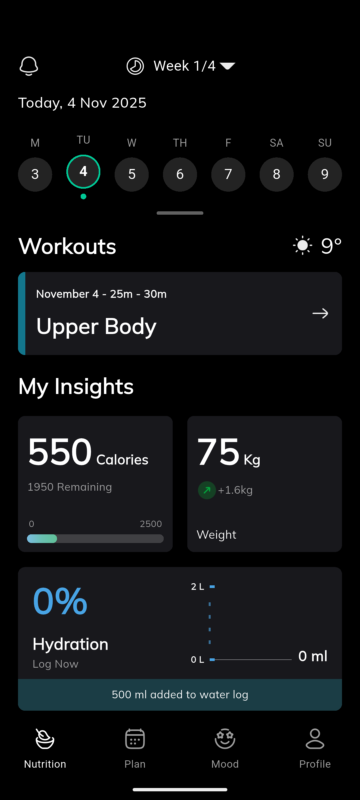
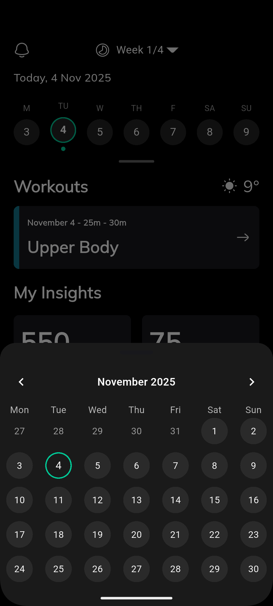
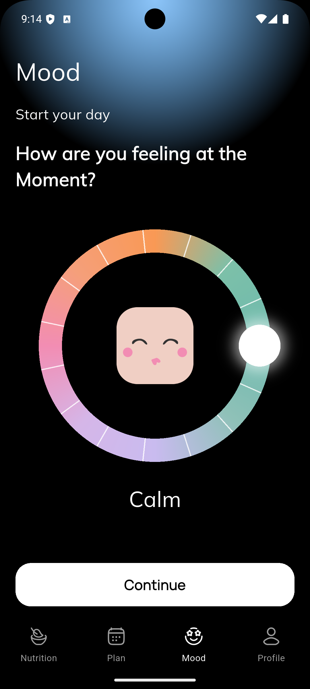

## EvenCir — Flutter Interview Test

This repository contains the EvenCir Flutter app used for the interview test submission.

Below are the required details for a GitHub submission: dependencies used (with reasons), a short project structure explanation, direct links to screenshots, a demo video and the APK for easy testing.

---

## 1) Dependencies used & why

The dependencies listed below are taken from the project's `pubspec.yaml` (versions present at the time of submission).

- `flutter` (SDK): The Flutter framework.
- `cupertino_icons` (^1.0.8): Platform-styled icons used by some widgets and for iOS look-and-feel where needed.
- `google_fonts` (^6.3.2): Provides easy access to Google Fonts for consistent typography across the app.
- `table_calendar` (^3.0.9): Used to render the calendar UI and provide calendar utilities such as date selection and visible days.

Why these were needed (short):
- `google_fonts` — chosen to quickly and cleanly apply a modern font family across the app without bundling font files manually.
- `table_calendar` — provides a feature-rich calendar widget out of the box (multi-day visible range, selection, styling) so the app can focus on UI/UX rather than re-implementing calendar mechanics.

If you expect other packages to be listed here (for example network or state management libs), they are not used in this submission. The project keeps state and local UI logic simple.

---

## 2) Project structure

Top-level folders and purpose (brief):

- `lib/` — Main application Dart code.
	- `constants/` — App-wide constants such as colors, images, text styles and static strings (`app_colors.dart`, `app_images.dart`, `app_text_styles.dart`, `app_texts.dart`).
	- `screens/` — Each screen for the app: `homeScreen.dart`, `moodScreen.dart`, `nutritionScreen.dart`, `planScreen.dart`, `profileScreen.dart`.
	- `utils/` — Reusable utilities (e.g., `calendar_utils.dart`).
	- `widgets/` — Reusable UI components and custom widgets (app bar, cards, mini calendar, mood ring painter, etc.).

- `assets/` — Images and icons used by the app (declared in `pubspec.yaml`).
- `screenshots/` — App screenshots for the README and review.
- `recording/` — App demo video (screen recording).


Note: Per the instructions, no changes were made to anything under `lib/` while preparing this README update.

---

## 🖼️ 3) App Screenshots

Below are direct previews of the app screens:

### 🏠 Home Screen


### 📅 Calendar Screen


### 😊 Mood Screen


### 📋 Plan Screen


---

## 🎥 4) App Demo Video

You can **watch the screen recording directly below** ⬇️

https://github.com/your-username/evencir_task/raw/main/recording/appDemo.mp4

*(If the above video doesn’t autoplay, click it to open directly in GitHub or download it.)*

---

## 📱 5) App APK

You can test the app by downloading the APK from Google Drive:

👉 [**Download APK (Google Drive)**](https://drive.google.com/file/d/118lrnmwS3Tkwvzo11CsKiOOyH0sN9GEx/view?usp=drive_link)

---

## ⚙️ 6) How to run

Make sure Flutter SDK and Android SDK are properly installed.

Run the following commands from the project root:

```bash
flutter pub get
flutter run        # Run the app on emulator or connected device
flutter build apk  # Build release APK


