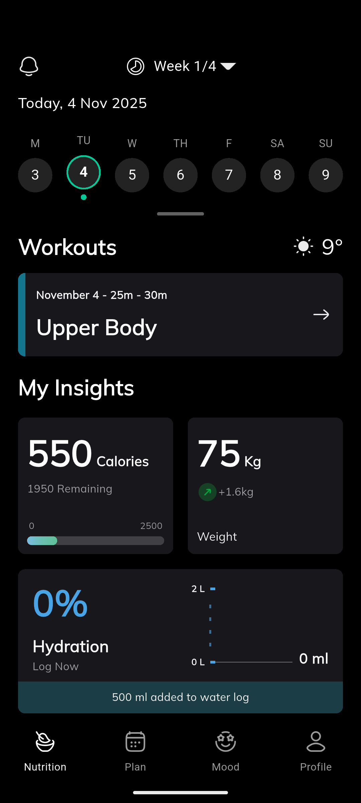
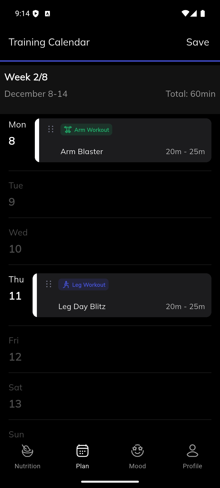
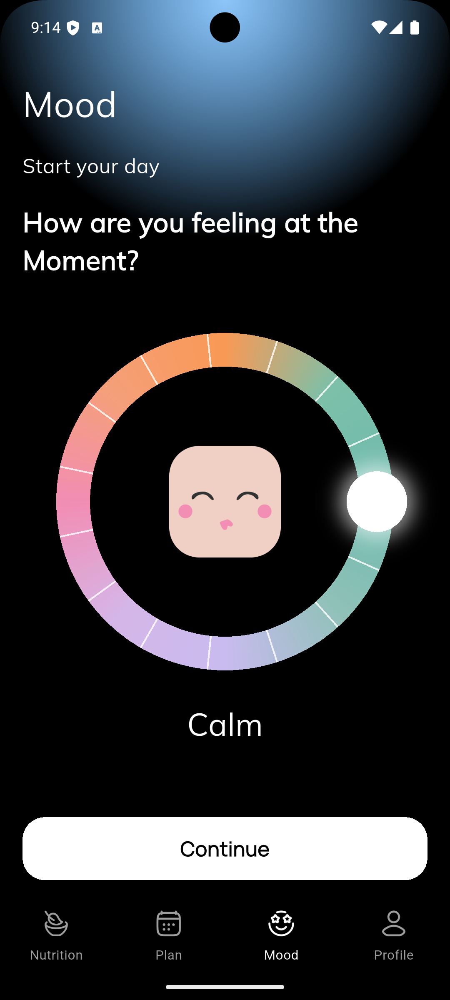
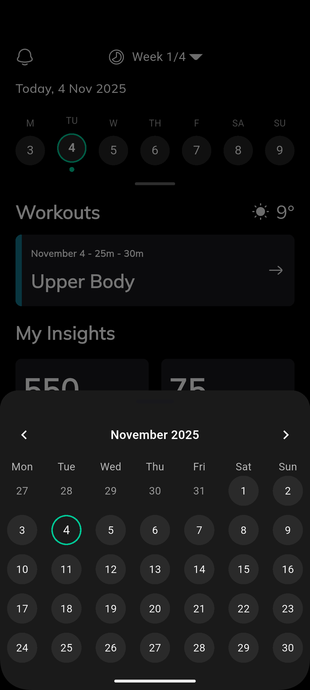

# ⚡ AuraFit — Smart Fitness & Wellness Tracker

A modern, responsive, and aesthetic Flutter application designed for structured workout planning, dynamic hydration & calorie tracking, and mindful mood logging.

> [!IMPORTANT]
> **Notice on UI Updates:**
> The linked Google Drive APK, screen recording, and repository screenshots reflect the initial baseline submission. To experience the latest enhanced UI (including the animated splash screen, interactive FL Chart fluid wave, dynamic calendar routines, Pro Profile, and responsive zero-overflow layouts), please **clone the repository and run it locally** using `flutter run`.

---

## 📱 App Screenshots

<div align="center">

| 🏠 Home & Nutrition | 📋 Training Plan |
| :---: | :---: |
|  |  |

| 😊 Mood Dial | 📅 Calendar View |
| :---: | :---: |
|  |  |

</div>

---

## 🛠️ Dependencies & Rationale

Dependencies from `pubspec.yaml`:

- **`flutter` (SDK)**: Core framework for cross-platform UI rendering.
- **`fl_chart` (^1.1.1)**: Powers the smooth, interactive hydration timeline wave chart with dynamic touch tooltips and animated curve transitions.
- **`google_fonts` (^6.3.2)**: Integrates modern typography (Manrope & Mulish) for clean hierarchy.
- **`table_calendar` (^3.0.9)**: Custom month & week calendar selector modal with active date highlighting.
- **`cupertino_icons` (^1.0.8)**: iOS-style iconography.

---

## 🏗️ Project Architecture

```
lib/
├── constants/       # App tokens (AppColors, AppImages, AppTexts, AppTextStyles)
├── screens/         # Feature screens
│   ├── splash_screen.dart     # Animated glowing brand splash
│   ├── homeScreen.dart        # Indexed navigation root
│   ├── nutritionScreen.dart   # Dashboard, hydration & calorie tracking
│   ├── planScreen.dart        # Dynamic drag-and-drop workout schedule
│   ├── moodScreen.dart        # Minimal 360° interactive mood dial
│   └── profileScreen.dart     # Pro Athlete metrics & sync settings
├── utils/           # Helper utilities (CalendarUtils, WorkoutUtils)
└── widgets/         # Reusable glassmorphic UI components & custom painters
```

---

## 🎥 App Demo Video

Watch the screen recording demo:

[<video src="./recording/appDemo.mp4" controls autoplay loop muted playsinline width="320">
	Your browser does not support the video tag.
</video>](https://github.com/user-attachments/assets/ff4c6c6a-3b4c-49ee-9733-fb44954bc421)

*(Click video above to preview or download directly from GitHub).*

---

## 📦 APK Download

Test the baseline APK via Google Drive:

👉 [**Download APK (Google Drive)**](https://drive.google.com/file/d/1N1DGwk9FaUM7rpdr-DKUzCn5CyRksxG_/view?usp=drive_link)

---

## 🚀 How to Run Locally

Ensure the Flutter SDK is installed and configured on your machine:

```bash
# 1. Clone the repository
git clone https://github.com/codexahmar/AuraFit.git

# 2. Navigate to project directory
cd AuraFit

# 3. Install dependencies
flutter pub get

# 4. Run on connected device or simulator
flutter run
```

